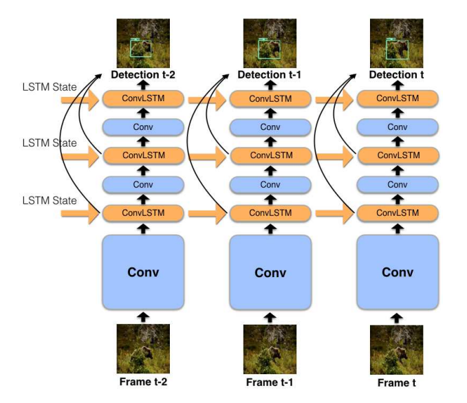

# video object detection

<!-- TABLE OF CONTENTS -->

  
Table of Contents

  <ol>
    <li>
      <a href="#overview">Overview</a>
    </li>
    <li>
      <a href="#challenge">Challenge</a>
    </li>
    <li>
      <a href="#method">Method</a>
    </li>
    <li><a href="#contact">Contact</a></li>
  </ol>

## Overview
Video object detection is a computer vision task that involves identifying and localizing objects of interest within a sequence of frames in a video. It extends the concept of image object detection to the temporal domain, allowing machines to not only recognize objects but also track their movements and interactions over time. This technology has numerous applications, ranging from surveillance and autonomous vehicles to video analytics and entertainment.

Video object detection involves performing object detection (object localization + object classification) on each frame of a video. While static object detection from still images is well-developed, video object detection introduces challenges due to the presence of poor-quality frames in videos, including blurriness, defocusing, partial occlusions, and uncommon poses. As a result, directly applying static object detection methods to video object detection may yield suboptimal results. Fortunately, videos contain temporal and contextual information that can be leveraged.

There are two main directions of research in video object detection: utilizing temporal and contextual information to enhance accuracy or accelerating detection speed while maintaining accuracy. Currently, most research is focused on improving the accuracy of video object detection

## Challenge
>[Video object recognition and detection](https://www.itransition.com/blog/video-object-recognition-detection)

One approach to video object detection is to split a video into its constituent frames and apply an image recognition algorithm to each frame. However, this jettisons all the potential benefits of inferring temporal information from the video.

Consider, for example, the challenge of occlusion and reacquisition: if a video object recognition framework identifies a man who is then briefly obscured by a passing pedestrian, the system will need a temporal perspective in order to understand that it has 'lost' the subject, and prioritize reacquisition.

A subject can be lost not only because of occlusion, but due to motion blur, in cases where either camera movement or subject movement (or both) causes enough disruption to the frame that features become streaked or out of focus, and beyond the ability of the recognition framework to identify.

>[Improved Handling of Motion Blur in Online Object Detection
](https://arxiv.org/abs/2011.14448v2)

Given that single-frame detection yields suboptimal results in video object detection, the primary focus is on integrating richer spatiotemporal features. This involves fusing features from various levels such as bbox, frame, feature, and proposal, compensating for the limitations of single-frame information in training and detection. The objective is to enhance overall detection performance by aggregating features from different levels. Here's a general approach to feature fusion across these levels:

## Method

Video object detection can be categorized into the following four major classes: tracking-based methods, recurrent neural network methods, optical flow-based multi-frame feature aggregation methods, and other methods.
I just more focus on these three methods

1. Tracking-Based Methods:
These approaches focus on enhancing detection accuracy and robustness by tracking objects across frames. They employ techniques such as Kalman filters, particle filters, and data association to maintain object identities. Tracking information aids in reducing false positives and false negatives and captures object motion behavior.

2. Recurrent Neural Network Methods:
Leveraging recurrent neural networks (RNNs) and their variants such as LSTMs, these methods model the temporal relationships in video sequences. By propagating information across a sequence of frames, they capture object context and motion patterns, leading to improved detection performance.

3. Optical Flow-Based Multi-Frame Feature Aggregation Methods:
These methods utilize optical flow (motion information between frames) to capture object motion. By aggregating features across multiple consecutive frames, they effectively handle fast motion or complex scenes involving objects.

These categories encompass various strategies that exploit the temporal dimension of videos to improve object detection accuracy, handle occlusions and challenging conditions, and provide a comprehensive understanding of object behavior within a video sequence. Each category has its strengths and weaknesses, and researchers often combine multiple approaches to achieve state-of-the-art performance in video object detection tasks. The continuous advancement of these techniques contributes to the development of more robust and effective video object detection systems across a wide range of applications, from surveillance to robotics and beyond.

I will list and describe some of papers based on these methods

### Detect to Track and Track to Detect

[[arxiv]](https://arxiv.org/abs/1710.03958) [[code]](https://github.com/feichtenhofer/Detect-Track)

introduces the integration of tracking into object detection by utilizing tracking to learn the similarity between features across different frames. This process enables ROI (Region of Interest) tracking, which estimates the inter-frame displacement of targets, thereby assisting in object detection. This approach enhances detection accuracy by leveraging tracking information to account for object movement between frames.

### FlowNet
[[arxiv]](https://arxiv.org/abs/1504.06852)

FlowNet introduces an optical flow network that estimates motion between frames, enabling feature enhancement through adaptive aggregation and improving video object detection

### Flow-Guided Feature Aggregation for Video Object Detection
[[arxiv]](https://arxiv.org/abs/1703.10025) [[code]](https://github.com/msracver/Flow-Guided-Feature-Aggregation)

Incorporating an optical flow network, the method extracts per-frame features, enhances them through warped neighboring frame features using adaptive weighting, and feeds the aggregated features into a detection network, as demonstrated in Flow-Guided Feature Aggregation for Video Object Detection.

### Fully Motion-Aware Network for Video Object Detection
[[paper]](http://openaccess.thecvf.com/content_ECCV_2018/papers/Shiyao_Wang_Fully_Motion-Aware_Network_ECCV_2018_paper.pdf) [[code]](https://github.com/wangshy31/MANet_for_Video_Object_Detection)

The paper introduces MANet, a novel approach for video object detection that combines pixel-level and instance-level calibration by extracting frame features, utilizing optical flow, predicting instance movements, and fusing features for improved accuracy.

### End-to-End Video Object Detection with Spatial-Temporal Transformers
[[arxiv]](https://arxiv.org/abs/2201.05047)[[code]](https://github.com/SJTU-LuHe/TransVOD)

End-to-End Video Object Detection with Spatial-Temporal Transformer leverages the temporal cues in video clips through a Transformer-based approach, treating the entire clip as a sequence and frames as words, enhancing object interactions both spatially and temporally. Key to this is the use of object queries akin to DETR, encoding instance-aware information, and the integration of temporal Transformers to connect sparse query embeddings, leveraging output memory from the DETR Transformer encoder to jointly model spatial and temporal information. This clip-level input Transformer approach accelerates video object detection, catering to practical applications that demand efficient detection in dynamic video contexts

### Memory Enhanced Global-Local Aggregation for Video Object Detection
[[arxiv]](https://arxiv.org/abs/2003.12063)[[code]](https://github.com/Scalsol/mega.pytorch)

The paper addresses two challenges in video object detection: the effective utilization of global semantic information across frames and the localization of objects within frames lacking clear context. To tackle the first issue, the authors introduce a base model comprising a global aggregation stage where global information is integrated into local frame features using relation modules. Subsequently, a local aggregation stage further enhances features of key frames. This resolves the problem of separate consideration of global and local information. To combat the second challenge, the paper introduces the Long Range Memory (LRM) module, inspired by Transformer-XL, which efficiently extends the observation range of key frames by storing and reusing intermediate features. This approach significantly amplifies the available global and local information. In combination, these advancements offer a holistic solution that merges global and local information while efficiently exploiting video data.

### Mobile Video Object Detection with Temporally-Aware Feature Maps
[[arxiv]](https://arxiv.org/abs/1711.06368v2) [[code]](https://github.com/tensorflow/models/tree/master/research/lstm_object_detection)

The paper introduces a real-time video object detection model designed for energy-efficient mobile and embedded devices. The approach combines rapid single-image object detection techniques with Convolutional Long Short-Term Memory (LSTM) layers, forming an interleaved recursive-convolutional architecture. Additionally, a resource-efficient Bottleneck-LSTM layer is proposed, substantially reducing computational costs compared to conventional LSTMs. The network employs Bottleneck-LSTM to refine and propagate inter-frame feature mappings, thus achieving temporal awareness.

The method employs the MobileNet architecture as a foundation for the SSD framework, and it replaces all convolutional layers in the SSD feature layers with depth-wise separable convolutions. The MobileNet backbone network is pruned by removing the final layers. This approach seamlessly integrates convolutional LSTM layers into our single-frame detector. Experimentally, multiple temporal modules (LSTMs) are inserted at various positions after feature maps, enabling the acquisition and learning of temporal-related information.

in particular, Due to resource constraints on edge devices, many temporal methods for video object detection, such as optical flow and attention-based techniques, require substantial computational resources and memory, making them unsuitable for resource-limited cameras in edge scenarios. Consequently, introducing a lightweight temporal RNN module is a viable solution, as it does not impose significant computational overhead. This approach aligns with practical deployment needs, ensuring compatibility with edge cameras' limited resources.

<!-- CONTACT -->
## Contact

Name - Feng Qingtian - feng_qingtian@u.nus.edu

